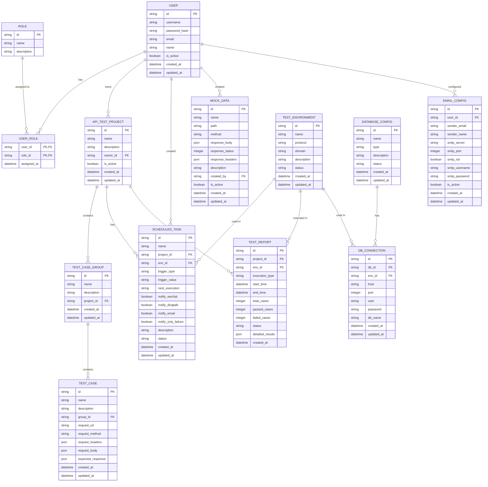

# 应用数据库设计图

以下是为应用设计的数据库结构ER图，使用Mermaid语法绘制：

## 数据库设计说明

1. **用户与权限管理**
   - `USER`表存储用户基本信息
   - `ROLE`表定义角色
   - `USER_ROLE`表实现用户与角色的多对多关系

2. **API测试管理**
   - `API_TEST_PROJECT`表存储测试项目
   - `TEST_CASE_GROUP`表存储测试用例组
   - `TEST_CASE`表存储具体测试用例

3. **环境与执行**
   - `TEST_ENVIRONMENT`表存储测试环境配置
   - `SCHEDULED_TASK`表存储定时任务
   - `TEST_REPORT`表存储测试报告

4. **其他功能**
   - `EMAIL_CONFIG`表存储邮件配置
   - `MOCK_DATA`表存储MOCK数据
   - `DATABASE_CONFIG`和`DB_CONNECTION`表存储数据库配置和连接信息

这个设计覆盖了应用的核心功能，同时保持了良好的扩展性。您可以根据实际需求进一步调整或简化这个设计。